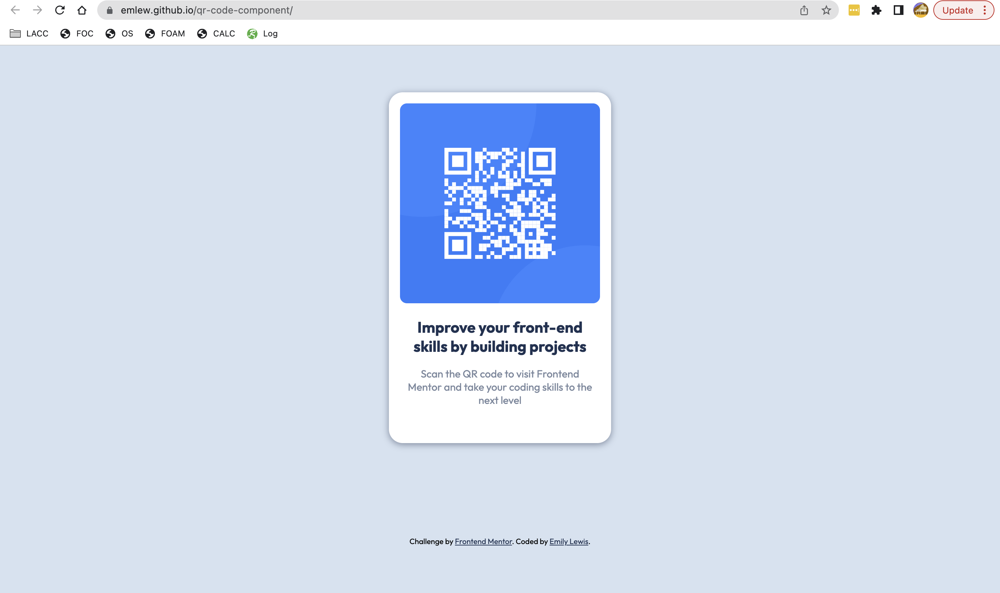

# Frontend Mentor - QR code component solution

This is a solution to the [QR code component challenge on Frontend Mentor](https://www.frontendmentor.io/challenges/qr-code-component-iux_sIO_H). Frontend Mentor challenges help you improve your coding skills by building realistic projects. 

## Table of contents

- [Overview](#overview)
  - [Screenshot](#screenshot)
  - [Links](#links)
- [My process](#my-process)
  - [Built with](#built-with)
  - [What I learned](#what-i-learned)
  - [Continued development](#continued-development)
  - [Useful resources](#useful-resources)
- [Author](#author)
- [Acknowledgments](#acknowledgments)

## Overview

### Screenshot



### Links

- Solution URL: [here](https://emlew.github.io/qr-code-component/)

## My process

### Built with

- Semantic HTML5 markup
- CSS custom properties
- CSS Grid
- [Google Fonts](https://fonts.google.com/specimen/Outfit) - For styles

### What I learned

This project helped me reinforce my grasp on CSS and HTML. I particularly enjoyed declaring variables in CSS with the following snippet:

```css
:root {
    font-family: "Outfit", sans-serif;
    --white: #fff;
    --light-blue: #D6E2F0;
    --gray: #7B879D;
    --navy: #1F3251;
  }
```

I had to pay special attention to the footer links as well. A quick `color: var(--navy);` allowed me to make sure that they were the same color as the unlinked text.

### Continued development

I would love to see how this design could be improved on mobile, or be built  more reactively.

### Useful resources

- [Box-shadow doc](https://developer.mozilla.org/en-US/docs/Web/CSS/box-shadow) - This helped me understand placement and color of the drop shadow on the QR container.

## Author

- Frontend Mentor - [@emlew](https://www.frontendmentor.io/profile/emlew)
- LinkedIn - [Emily Lewis](https://www.linkedin.com/in/emily-lewis-390a51228/)

## Acknowledgments

Thanks to FreeCodeCamp for their Web Design certification course!
